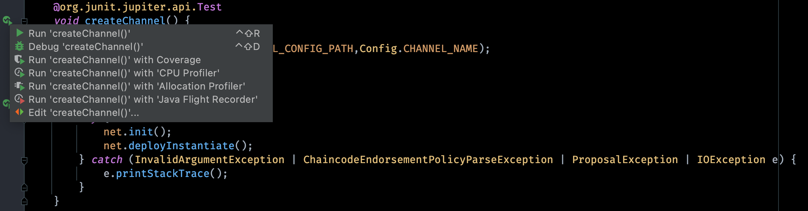
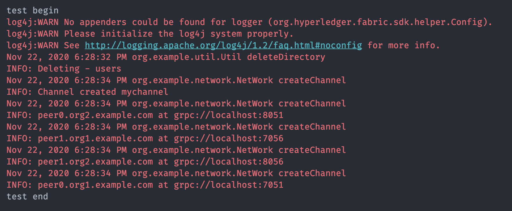
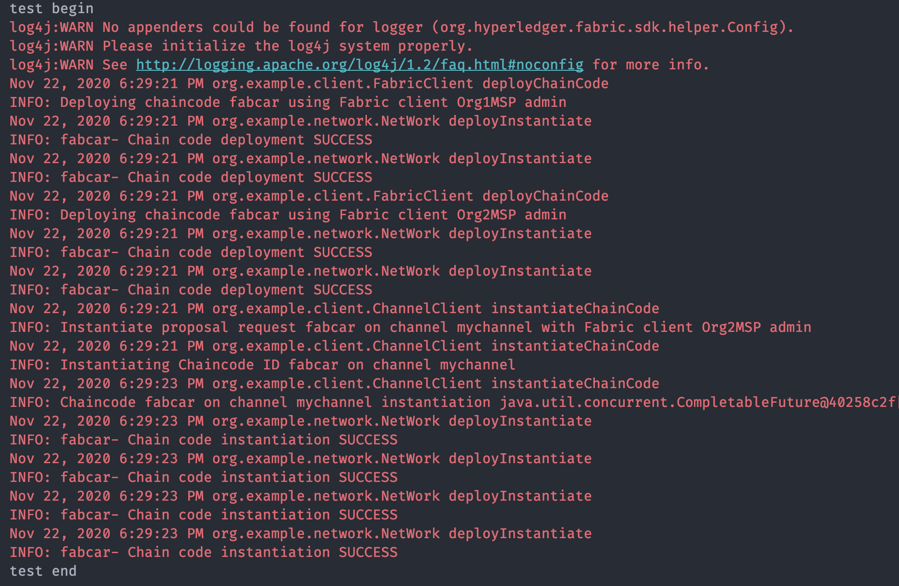
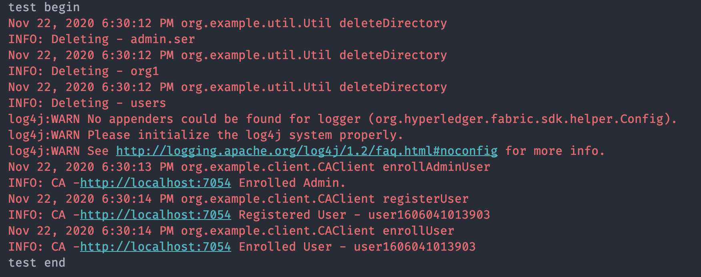
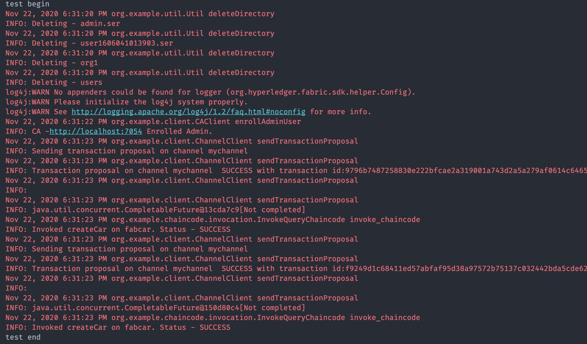
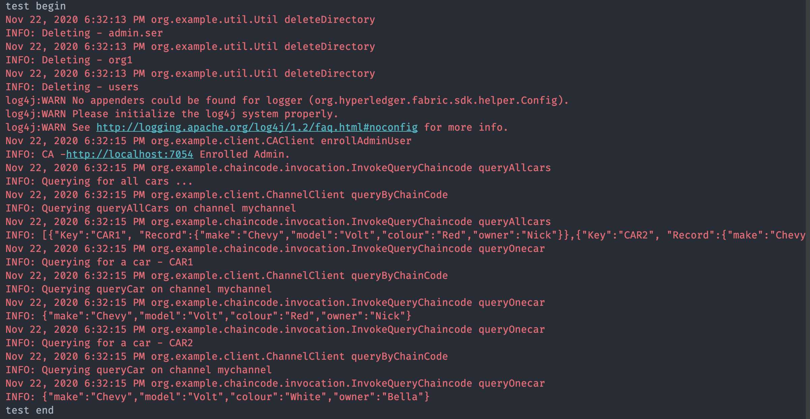

## fabric-sdk-java 实现案例

### 简单测试流程

#### 环境准备
* Docker
* Docker-Compose
* IntelliJ IDEA
* docker镜像
  * fabric-ca:1.4
  * fabric-orderer:1.4
  * fabric-peer:1.4

#### 1、启动网络

使用如下命令clone[代码库](https://github.com/ldstyle8/fabCar.git):

```
$ https://github.com/ldstyle8/fabCar.git
```

使用如下命令启动fabric底层网络：

```
$ cd cd network
$ ./build.sh
```

后续完成测试后可以使用如下命令关闭或清理fabric网络环境：

```
$ ./stop.sh
```

或者

```
$ ./teardown.sh
```


#### 2、运行测试

使用IntelliJ IDEA运行测试文件，测试文件在 src/main/test/ 目录下。部分代码如下：



##### 2.1 创建应用通道

运行测试函数 createChannel()，结果显示如下：



##### 2.2 部署并实例化链码

运行测试函数 deployInstantiate() 部署并实例化链码，结果显示如下：



##### 2.3 向CA注册并登记用户

运行测试函数 reu() ，向CA注册并登记用户，包括组织管理员Admin和普通用户，结果显示如下：



##### 2.4 调用链码

运行测试函数 invokeChaincode() ，调用链码，添加fabCar信息上链，结果显示如下：



##### 2.5 链码查询

运行测试函数 QueryChaincode() ，通过链码查询相关信息，结果显示如下：



**NOTE:** 写的比较简单，后续有问题可随时交流。。。

